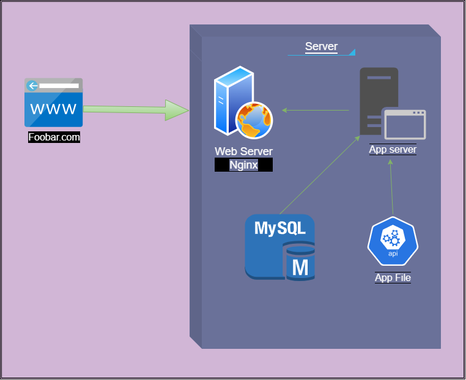

<h1>Web infrastructure design</h1>

<h3>What is a server ?</h3>

A server is a computer or system that provides resources, services,
or data to other computers, known as clients, over a network.

<h3>What type of DNS record www is in www.foobar.com ?</h3>

The "www" in "www.foobar.com" typically corresponds to a CNAME (Canonical Name) DNS record.

<h3>What is the role of the web server ?</h3>

The role of a web server is to serve web pages and content to clients (such as web browsers) over the internet..

<h3>What is the role of the application server ?</h3>

An application server is a software framework or platform that
facilitates the execution and management of applications, typically for web or
entreprise purposes.

<h3>What is the role of the database ?</h3>

For the storage of data.

<h3>What is the server using to communicate with the computer of the user requesting the website ?</h3>

it use HTTP.

<h3>What is the role of the domain name ?</h3>

To access the server more easily thanwith a public IP address.

<h3>A server can be physical or virtual...</h3>

You can install a virtualisation in server for simulate a physical server(app XAMP)

<h3>That a server runs an OS...</h3>

as ubuntu or other os supported by infrastructur.

<h3>Explained that a web server’s role is to serve web pages (static content)</h3>

A web server serves web pages to clients.

<h3>Explains that an application server’s role is to compute dynamic content</h3>

An application server's role is to compute dynamic content.

<h3>Explains that a database’s role is to store application data</h3>

It's for optimaze the traitemnt of data.

<h3>Explained that the DNS’s role is to translate the record of a domain name into an IP address</h3>

DNS's role is to translate domain names into IP addresses.

<h3>Explained that www.foobar.com is an A record because it resolves to an IP address</h3>

The domain name(foobar.com) is for return the acces to the web site easily.

<h3>Explained that this server is a single point of failure because nothing is redundant</h3>

This server is a single point of failure due to the absence of redundancy.

<h3>Explained that the website would be temporarily down when new code is deployed and the web server needs to be restarted</h3>

The website may experience temporary downtime during code deployment when the web server requires a restart.

<h3>Explained that this infrastructure cannot scale and will not be able to handle traffic that would exceed the server capacity</h3>

This infrastructure is not scalable and would be unable to handle traffic beyond the server's capacity.

<h3>Explained that the server is communicating over a network (TCP/IP)</h3>

The server communicates over a network using the TCP/IP protocol.

