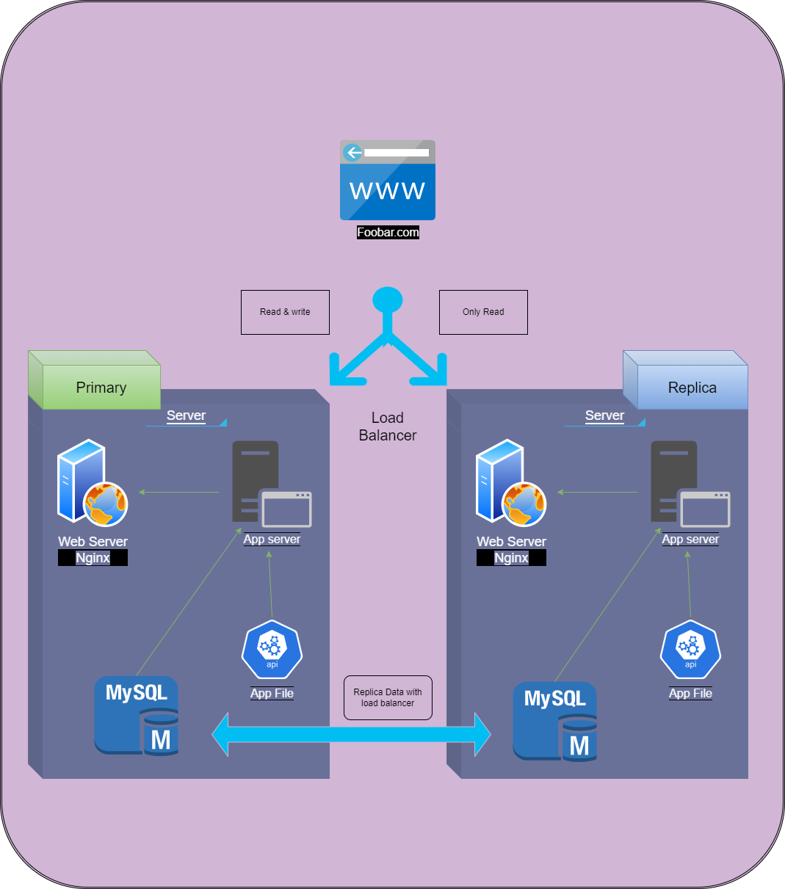

<h3>For every additional element, why you are adding it</h3>

<h3>What distribution algorithm your load balancer is configured with and how it works</h3>

<h3>Is your load-balancer enabling an Active-Active or Active-Passive setup, explain the difference between both</h3>

<h3>How a database Primary-Replica (Master-Slave) cluster works</h3>

<h3>What is the difference between the Primary node and the Replica node in regard to the application ?</h3>

<h3>Explain if the load balancer is configured to have an active-active or active-passive setup (their choice)</h3>

